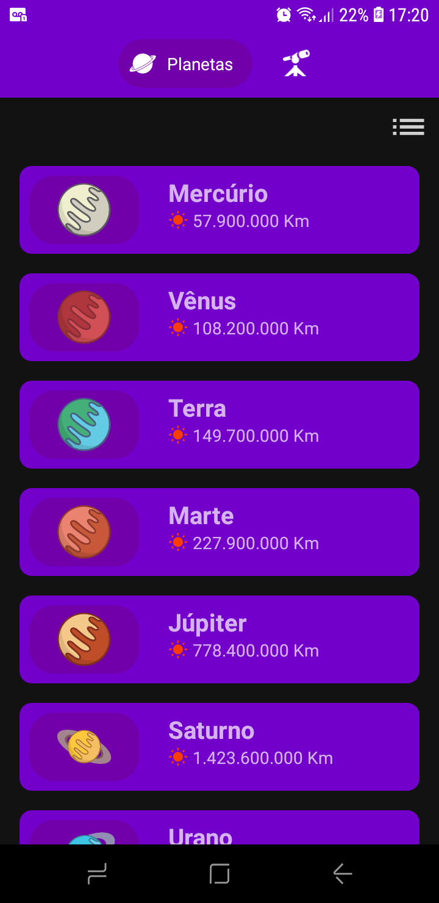
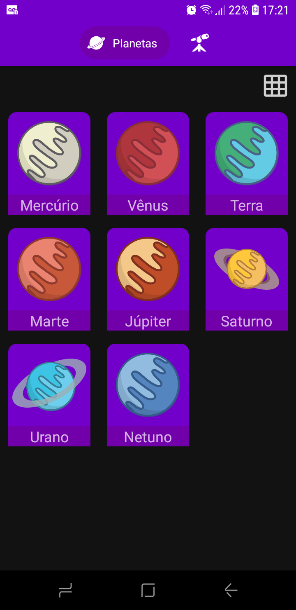
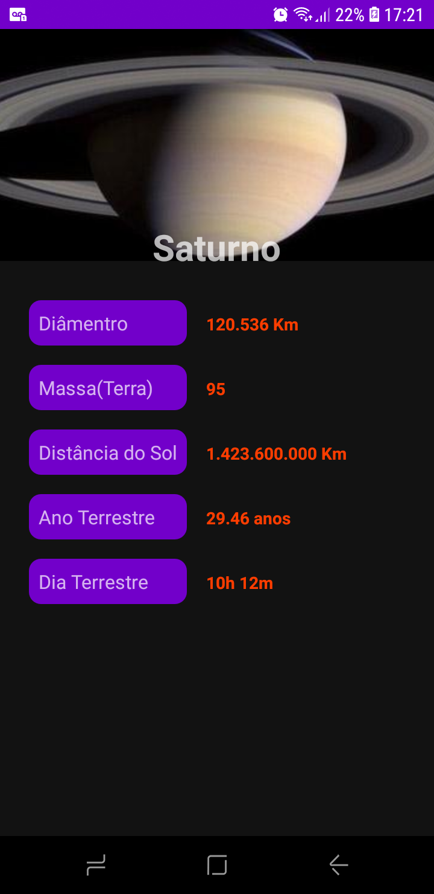
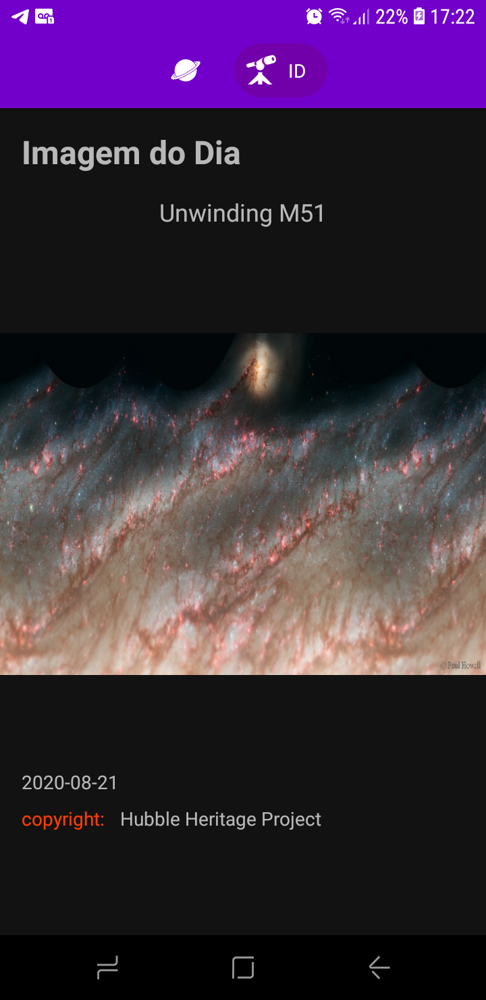

<h1>
Astronomical

</h1>

   

# Sobre o projeto
 Desenvolvido com intuito de aprofundar os estudos em Kotlin. O app exibe informações dos planetas e recupera imagens astronômicas diárias da open API da Nasa 🚀

## Construído com 
* Retrofit2
* Picasso
* RecyclerView
* GridLayoutManager
